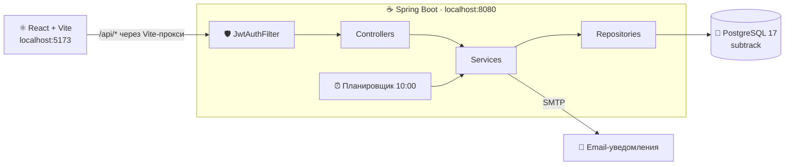

<h1 align="center">💸 Subtracker</h1>

<p align="center"><b>Privacy-first трекер подписок</b> — все подписки под контролем: сколько уходит в месяц, когда спишут деньги и кто из друзей сколько должен.<br/>Без доступа к банку. Данные не покидают ваш сервер.</p>

<p align="center">
  
  
  
  
  
  
  
</p>

---

## ✨ Возможности

- 🔐 **Регистрация и вход по JWT** — каждый видит только свои подписки
- 📋 **CRUD подписок** — название, цена, категория, дата и цикл оплаты (неделя/месяц/квартал/год)
- 💰 **Сумма в месяц** — годовые и недельные подписки нормализуются к месячной цене
- 📅 **Ближайшие списания** — что спишется в ближайшие N дней (`nextBillingDate` считается автоматически)
- ⏳ **Триалы** — за 2 дня до конца пробного периода придёт письмо-напоминание
- 📈 **История цен** — каждое изменение цены сохраняется; при подорожании прилетает email-алерт
- 👥 **Совместные подписки** — добавьте участников и узнайте, кто сколько должен вам в месяц

## 🏗️ Архитектура и стек

| Слой | Технологии |
|---|---|
| **Бэкенд** | Java 17 · Spring Boot 3.3 · Spring Data JPA · Spring Security + JWT (jjwt 0.12) · Spring Mail |
| **Фронтенд** | React 19 · Vite · chart.js · i18n (ru/en) · тёмная тема |
| **База данных** | PostgreSQL 17 (база `subtrack`), схему создаёт Hibernate (`ddl-auto=update`) |
| **Сборка** | Gradle 9.5 (бэк) · npm (фронт) |

Архитектура бэкенда — классическая слоёная: `controller → service → repository → model`.



Уведомления построены на паттерне «Стратегия»: ядро зависит от интерфейса `NotificationSender`, сейчас реализация — email. Добавление нового канала (например, Telegram) = один новый класс, ядро не меняется.

## 🔐 Как устроена авторизация (важно для фронта!)

1. Пользователь регистрируется → `POST /api/auth/register`
2. Логинится → `POST /api/auth/login` → в ответе приходит **JWT-токен**
3. Токен нужно сохранить (например, в `localStorage`) и слать **с каждым запросом** в заголовке:

```
Authorization: Bearer <токен>
```

⚠️ **Без токена любой запрос (кроме `/api/auth/**`) вернёт `401`, и данные не отобразятся.** Токен живёт **24 часа** — после протухания сервер снова начнёт отвечать 401, нужно перелогиниться.

## 📚 API

Базовый адрес: `http://localhost:8080` (фронт в dev-режиме ходит через Vite-прокси, поэтому в коде фронта пути начинаются просто с `/api/...`).

### Обзор эндпоинтов

| Метод | Путь | Что делает | Токен |
|---|---|---|:---:|
| POST | `/api/auth/register` | Регистрация | — |
| POST | `/api/auth/login` | Вход, выдаёт JWT | — |
| GET | `/api/subscriptions` | Все мои подписки | ✅ |
| POST | `/api/subscriptions` | Создать подписку | ✅ |
| PUT | `/api/subscriptions/{id}` | Обновить подписку | ✅ |
| DELETE | `/api/subscriptions/{id}` | Удалить подписку | ✅ |
| GET | `/api/subscriptions/total` | Сумма расходов в месяц | ✅ |
| GET | `/api/subscriptions/upcoming?days=7` | Списания в ближайшие N дней | ✅ |
| GET | `/api/subscriptions/{id}/price-history` | История изменений цены | ✅ |
| POST | `/api/subscriptions/{id}/members` | Добавить участника | ✅ |
| GET | `/api/subscriptions/{id}/members` | Участники и их доли | ✅ |
| DELETE | `/api/subscriptions/{id}/members/{memberId}` | Убрать участника | ✅ |
| GET | `/api/subscriptions/debts` | Кто сколько должен мне в месяц | ✅ |

---

### 🔑 POST `/api/auth/register`

Тело запроса:

```json
{ "email": "user@example.com", "password": "secret123" }
```

- `email` — валидный email, обязателен
- `password` — минимум 6 символов

Ответ `201 Created`:

```json
{ "id": 1, "email": "user@example.com", "createdAt": "2026-07-20T21:00:00" }
```

Ошибки: `400` — невалидные данные · `409` — email уже занят

### 🔑 POST `/api/auth/login`

Тело запроса — как у register. Ответ `200 OK`:

```json
{ "token": "eyJhbGciOiJIUzI1NiJ9..." }
```

Ошибки: `401` — неверный email или пароль (сообщение одинаковое специально, чтобы не подсказывать взломщику, что именно не так)

**curl (PowerShell):**

```powershell
curl.exe -X POST http://localhost:8080/api/auth/login -H "Content-Type: application/json" -d "{\"email\":\"user@example.com\",\"password\":\"secret123\"}"
```

**fetch (фронт):**

```js
const res = await fetch("/api/auth/login", {
  method: "POST",
  headers: { "Content-Type": "application/json" },
  body: JSON.stringify({ email, password }),
});
if (!res.ok) throw new Error("Неверный email или пароль");
const { token } = await res.json();
localStorage.setItem("token", token);
```

---

### 📋 GET `/api/subscriptions`

Ответ `200 OK` — массив подписок:

```json
[
  {
    "id": 1,
    "name": "Netflix",
    "price": 649.00,
    "billingDate": "2026-07-25",
    "nextBillingDate": "2026-07-25",
    "trialEndDate": null,
    "category": "entertainment",
    "billingCycle": "MONTHLY",
    "createdAt": "2026-07-01T12:00:00"
  }
]
```

- `nextBillingDate` — **вычисляется на бэке**: ближайшая будущая дата списания с учётом цикла. Используйте её для бейджей «скоро спишется»
- `trialEndDate` — `null`, если подписка не пробная

**fetch:**

```js
const res = await fetch("/api/subscriptions", {
  headers: { Authorization: `Bearer ${localStorage.getItem("token")}` },
});
const subs = await res.json();
```

### ➕ POST `/api/subscriptions` · ✏️ PUT `/api/subscriptions/{id}`

Тело запроса (одинаковое для создания и обновления):

```json
{
  "name": "Netflix",
  "price": 649,
  "billingDate": "2026-07-25",
  "category": "entertainment",
  "billingCycle": "MONTHLY",
  "trialEndDate": null
}
```

| Поле | Обязательно | Правила |
|---|:---:|---|
| `name` | ✅ | не пустое |
| `price` | ✅ | число > 0 |
| `billingDate` | ✅ | дата `YYYY-MM-DD` |
| `billingCycle` | ✅ | `WEEKLY` / `MONTHLY` / `QUARTERLY` / `YEARLY` |
| `category` | — | строка |
| `trialEndDate` | — | дата; `null` = не триал |

Ответы: POST → `201` с созданной подпиской · PUT → `200` с обновлённой · `404` — чужая или несуществующая

> 💡 При изменении цены через PUT бэкенд сам запишет старую и новую цену в историю, а при подорожании отправит владельцу email-алерт.

**curl (PowerShell):**

```powershell
curl.exe -X POST http://localhost:8080/api/subscriptions -H "Content-Type: application/json" -H "Authorization: Bearer ВАШ_ТОКЕН" -d "{\"name\":\"Netflix\",\"price\":649,\"billingDate\":\"2026-07-25\",\"billingCycle\":\"MONTHLY\"}"
```

### 🗑️ DELETE `/api/subscriptions/{id}`

Ответ `204 No Content` (без тела) · `404` — чужая или несуществующая

### 💰 GET `/api/subscriptions/total`

Ответ `200 OK` — просто число (все циклы приведены к месяцу):

```json
1249.00
```

### 📅 GET `/api/subscriptions/upcoming?days=7`

Подписки, у которых списание в ближайшие `days` дней (по умолчанию 7), отсортированы по дате. Формат элементов — как у `GET /api/subscriptions`.

### 📈 GET `/api/subscriptions/{id}/price-history`

Ответ `200 OK` — свежие изменения сверху:

```json
[
  { "oldPrice": 649.00, "newPrice": 749.00, "changedAt": "2026-07-20T18:30:00" }
]
```

### 👥 Совместные подписки

**POST `/api/subscriptions/{id}/members`** — добавить участника (просто имя, не юзер приложения):

```json
{ "name": "Вася" }
```

Ответ `201`:

```json
{ "id": 3, "name": "Вася", "monthlyShare": 249.67 }
```

`monthlyShare` — доля одного человека в месяц: месячная цена ÷ (участники + владелец).

**GET `/api/subscriptions/{id}/members`** — список участников с их долями.

**DELETE `/api/subscriptions/{id}/members/{memberId}`** — `204`, участник убран (доли остальных пересчитаются при следующем запросе).

**GET `/api/subscriptions/debts`** — сводка по всем подпискам, отсортирована по убыванию долга:

```json
[
  { "name": "Вася", "monthlyDebt": 482.34 },
  { "name": "Оля", "monthlyDebt": 249.67 }
]
```

> Если Вася сидит и на Netflix, и на Spotify — его доли сложатся в одну строку.

---

### ❗ Коды ошибок

| Код | Когда | Что показать юзеру |
|---|---|---|
| `400` | Невалидные данные (пустое имя, цена ≤ 0…) | Текст ошибки из ответа |
| `401` | Нет токена / протух / неверный логин | Экран входа |
| `404` | Подписка не существует **или чужая** (нарочно неотличимо) | «Не найдено» |
| `409` | Email уже зарегистрирован | «Такой email уже есть» |

## 🧑‍💻 Памятка для фронтендера

> Привет! Вот что изменилось на бэке и что нужно знать перед запуском 👇

1. **⛔ Бэкенд теперь НЕ стартует без настроек почты.** Скопируй `src/main/resources/application-example.properties` в `src/main/resources/application.properties` (он в .gitignore, в git не попадёт) и заполни СВОИ значения: пароль Postgres, jwt.secret и блок `spring.mail.*`. Для Gmail нужен **App Password** (16 символов, создаётся в настройках Google-аккаунта при включённой двухфакторке), обычный пароль не подойдёт.
2. **☕ Java:** для сборки нужен JDK 17+. Если системная Java ниже — создай файл `C:\Users\<твоё_имя>\.gradle\gradle.properties` со строкой `org.gradle.java.home=<путь к твоему JDK 17>`. В репозитории этого файла больше нет (он машинно-зависимый).
3. **🔑 Главная задача фронта:** слать `Authorization: Bearer <токен>` на все запросы, кроме `/api/auth/**`. Пока этого нет — все запросы получают 401, и данные не отображаются. Токен живёт 24 часа; ловите 401 → редирект на логин.
4. **🌐 CORS не нужен** — фронт ходит через Vite-прокси (`/api` → `localhost:8080`), ничего настраивать не надо.
5. **▶️ Запуск:** сначала бэк (`.\gradlew.bat bootRun` или Run на `DemoApplication`), потом фронт (`npm run dev`) → http://localhost:5173. Postgres стартует сам как служба Windows.
6. **🧹 Просьба:** удали, пожалуйста, `src/components/StatusCards copy.jsx` — случайный дубликат в репозитории.

---

<p align="center">Сделано двумя людьми и одним ИИ ☕ · 2026</p>
